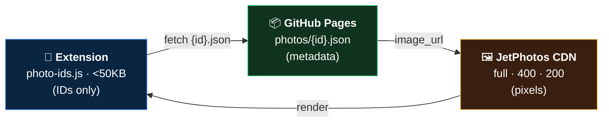
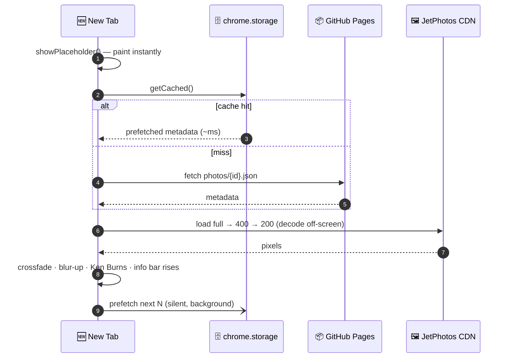

<div align="center">


# ✈ Aviation Gallery — New Tab

### *Every new tab, a breathtaking aircraft. Powered by [JetPhotos](https://www.jetphotos.com).*

A feather-light Chrome extension that clones **Google Earth View's** legendary
architecture — but for aviation. Open a tab, get a full-screen aircraft photo with
a cinematic Ken-Burns drift, glassy attribution overlay, and instant prefetched paints.

<br/>


<sub>🧩 < 50 KB extension &nbsp;·&nbsp; 🛰️ data on GitHub Pages &nbsp;·&nbsp; 🖼️ images straight from the CDN &nbsp;·&nbsp; 🪶 no frameworks, no trackers</sub>

</div>

---

> **Google could build Earth View because it owned both the content and the CDN.**
> We don't own the content — so we add a wafer-thin metadata layer on GitHub Pages,
> credit every photographer, and drive traffic *back* to JetPhotos. Same elegant
> runtime, honest model.

## 🧠 The architecture, in one breath

The extension binary ships **only an array of photo IDs**. Everything else streams in
at runtime. Three layers, fully decoupled — update the gallery with a `git push`, never
re-publish the extension.



## 🎞️ What happens when you open a tab



No half-painted flashes: every image is **`decode()`-ed off-screen** before it
crossfades in. A fast thumbnail paints first (blurred), then **sharpens up** to full-res.

## ⭐ Features

| | |
|---|---|
| 🎬 **Cinematic motion** | 26 s Ken-Burns drift, 0.6 s crossfade, blur-up reveal, rise-in overlay |
| 🪜 **Graceful degradation** | `full → 400 → 200 → bundled placeholder`, each with timeouts |
| ⚡ **Instant paints** | background prefetch into `chrome.storage`; warmed HTTP cache |
| 🔀 **No repeats** | anti-repeat history ring; session ⬅️/➡️ back-forward stack |
| ❤️ **Favorites** | one-key save to local storage |
| ⌨️ **Keyboard-first** | <kbd>Space</kbd> <kbd>→</kbd> next · <kbd>←</kbd> prev · <kbd>F</kbd> fav · <kbd>I</kbd> info · <kbd>Esc</kbd> hide |
| 🔒 **Locked-down CSP** | images only from `cdn.jetphotos.com`, data only from `*.github.io` |
| ♿ **Respectful** | full `prefers-reduced-motion` support; semantic, attribution-first |
| 🪶 **Zero runtime deps** | pure vanilla ES modules; icons + placeholder generated with stdlib Python |

## 🛠️ The build pipeline (`data-builder/`)

A **one-shot** tool (not a crawler) turns curated photo URLs into structured JSON.


- **`scraper.py`** — `og:title`-first extraction (calibrated against the real JetPhotos
  DOM), CDN size derivation, `--from-html` mode (because JetPhotos sits behind
  Cloudflare), `--dry-run / --incremental / --verify-only / --stats`.
- **`classifier.py`** — word-boundary-aware type → category engine
  (so *Sky**hawk*** ≠ military, but *CRJ900* still narrowbody). **20/20** unit tests.
- **`validator.py`** — CDN liveness checks. **`make-assets.py`** — icons + placeholder
  rendered as raw PNG with nothing but `zlib` + `struct`.

## 🧪 Verified, not vibe-checked

<div align="center">

| Gate | Result |
|------|:------:|
| `classifier.py` unit tests | ✅ 20 / 20 |
| `node --check` (all ES modules) + `py_compile` | ✅ clean |
| `test-integration.sh` | ✅ 6 / 6 |
| Playwright browser smoke test | ✅ no JS exceptions |
| Parser vs **real** JetPhotos DOM | ✅ calibrated |
| Live CDN image load (real Chrome) | ✅ confirmed |
| Packaged bundle | ✅ 52 KB (< 100 KB) |

</div>

## 📁 Project structure

```
.
├── extension/            # 🧩 the Chrome extension (load this in chrome://extensions)
│   ├── manifest.json     #    MV3 · storage + alarms · strict CSP
│   ├── newtab.{html,css,js}
│   ├── cache.js          #    storage layer (+ localStorage fallback, SW-safe)
│   ├── service-worker.js #    install + 4h-alarm prefetch
│   ├── photo-ids.js      #    ⭐ the only "database" shipped (IDs)
│   ├── config.js / config.dev.js
│   ├── icons/ · assets/placeholder.png
├── data-builder/         # 🐍 one-shot build tool → output/ JSON
│   ├── scraper.py · classifier.py · validator.py · make_sample_data.py
│   └── PARSING_GUIDE.md · samples/ · output/
├── scripts/              # 🔧 make-assets · sync-photo-ids · serve · test · deploy · package
├── phase0-cdn-test/      # 🔬 throwaway probe: do CDN images load in an extension page?
└── PHASE0_RESULT.md      # 📋 feasibility findings
```

## 🚀 Quick start

```bash
# 1) build sample data (or your own — see "Data & rights")
cd data-builder && python3 make_sample_data.py --clean && cd ..
bash scripts/sync-photo-ids.sh          # ID array → extension
bash scripts/test-integration.sh        # 6/6 ✅

# 2) preview locally
bash scripts/serve-data.sh              # data on :8080
#   in newtab.js switch the config import to ./config.dev.js, then
#   chrome://extensions → Load unpacked → select extension/
```

<details>
<summary><b>📡 Data &amp; rights (read me)</b></summary>

JetPhotos is behind Cloudflare (HTTP 403 to bots), so direct scraping is out.
The supported flow is **`--from-html`**: open each curated page in your browser,
*Save As → HTML*, drop it in `data-builder/samples/<id>.html`, then:

```bash
cd data-builder && pip install -r requirements.txt
python3 scraper.py --from-html samples/ --dry-run   # verify extraction
python3 scraper.py --from-html samples/             # write JSON
```

**Photographs belong to their photographers; the CDN belongs to JetPhotos.** This
extension credits every photographer, links back to the original, and ships no
download button. The data layer is **source-agnostic** — point `DATA_BASE_URL`
anywhere. Confirm you have the right to feature any photo before publishing.
</details>

<details>
<summary><b>🌐 Deploy to GitHub Pages</b></summary>

```bash
bash scripts/deploy-data.sh --push      # sync output/ → jetphotos-data repo, push
# set extension/config.js → DATA_BASE_URL to https://<you>.github.io/jetphotos-data
bash scripts/package.sh                 # → aviation-gallery-newtab-vX.Y.Z.zip (<100KB)
```
The `gh-pages/` folder is a persistent clone; `--push` commits + pushes in one shot.
</details>

## 🗺️ Roadmap

- **v1** — curated gallery on GitHub Pages ✅ *(you are here)*
- **v2** — hot-updatable IDs: merge a remote `index.json` at startup, no re-publish
- **v3** — Cloudflare Worker backend; library grows itself. *Migration = one config line.*

## 🙏 Credits

- 📷 **Aircraft photography** © the respective photographers, via **[JetPhotos.com](https://www.jetphotos.com)** — this project is a discovery engine that sends traffic their way.
- 💡 **Architecture** inspired by Google **Earth View**.
- 🧑‍💻 **Code** released under the **MIT License**. Photographs are *not* covered by it.

<div align="center">
<br/>
<sub>Built tab by tab. ✈</sub>
</div>
